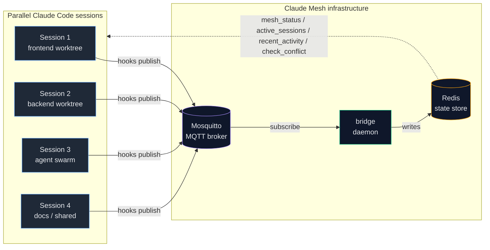

# Claude Mesh

> Observability mesh for parallel [Claude Code](https://claude.com/claude-code) sessions.

[](LICENSE)
[](https://pkg.go.dev/github.com/marioser/claude-mesh)

Run multiple Claude Code sessions in parallel? Claude Mesh gives every session
a live view of what the others are doing: who is active, in what repo, on what
branch, touching which files, and how recently. It also detects file
conflicts across sessions before they become merge conflicts.

Built for developers using worktrees, agent swarms, monorepos, or shared dev
machines.

---

## What it does

- **Cross-session visibility** — every Claude Code session publishes lifecycle
  and tool-use events; every session can query the shared state.
- **File conflict detection** — warn before two sessions touch the same file.
- **MCP integration** — exposes tools (`mesh_status`, `mesh_active_sessions`,
  `mesh_recent_activity`, `mesh_check_conflict`, `mesh_announce`) so Claude can
  query the mesh directly during a conversation.
- **Status line integration** — one-line summary of mesh activity for Claude
  Code's `statusLine`.
- **MQTT-based** — local Mosquitto broker, no cloud dependency, your data
  stays on your machine.

---

## Architecture

Solid arrows are event flow (hooks publish, bridge subscribes, bridge writes
state). Dashed arrows are MCP queries that Claude can issue mid-conversation
to read the shared state.



The point of the mesh becomes clear with multiple sessions running in
parallel: every session publishes its lifecycle and tool-use events, the
bridge consolidates them in Redis, and any session can query the shared
state through MCP tools without knowing about the others up front.

Three components ship as Go binaries:

| Binary | Role |
|---|---|
| `claude-mesh-bridge` | Long-running daemon. Subscribes to MQTT, persists state to Redis. |
| `claude-mesh-mcp` | MCP server that exposes mesh tools to Claude Code. |
| `claude-mesh-bridge install/uninstall` | Wires up hooks, launchd unit, and MCP config. |

---

## Quick start

### Prerequisites

- Go 1.24+ (only required if installing from source)
- Mosquitto MQTT broker on `localhost:1883`
- Redis on `localhost:6379`
- macOS (Linux support is limited in v0.1 — see [Linux notes](#linux-support))

The fastest way to get the broker + Redis is the bundled `docker-compose.yml`
(coming in v0.1 — see issues).

### Install

#### Option A — install script (recommended once releases ship)

```bash
curl -fsSL https://raw.githubusercontent.com/marioser/claude-mesh/main/install.sh | bash
```

#### Option B — `go install`

```bash
go install github.com/marioser/claude-mesh@latest
go install github.com/marioser/claude-mesh/cmd/claude-mesh-mcp@latest
```

Then wire up hooks, launchd, and MCP entry:

```bash
claude-mesh-bridge install
```

This is idempotent — running it again won't duplicate anything.

### Verify

Open a Claude Code session and ask:

> Are there other Claude Code sessions active right now?

Claude will call `mesh_status` and report active sessions, cwd, and branches.

You can also check directly:

```bash
claude-mesh-bridge status --json
```

Healthy output includes `mqtt: { connected: true, subscribed: true }`.

---

## Configuration

All config is via environment variables. None are required for the default
local-host setup.

| Variable | Default | Purpose |
|---|---|---|
| `CLAUDE_MESH_MQTT_HOST` | `localhost` | MQTT broker host |
| `CLAUDE_MESH_MQTT_PORT` | `1883` | MQTT broker port |
| `CLAUDE_MESH_MQTT_USERNAME` | _(empty)_ | MQTT auth user |
| `CLAUDE_MESH_MQTT_PASSWORD` | _(empty)_ | MQTT auth password |
| `CLAUDE_MESH_REDIS_ADDR` | `localhost:6379` | Redis address |
| `CLAUDE_MESH_REDIS_PASSWORD` | _(empty)_ | Redis auth password |
| `CLAUDE_MESH_REDIS_DB` | `0` | Redis DB index |
| `CLAUDE_MESH_LOG_LEVEL` | `info` | `debug \| info \| warn \| error` |
| `CLAUDE_MESH_LOG_DIR` | `~/Library/Logs` (macOS) | Where the daemon writes logs |
| `CLAUDE_MESH_ANTHROPIC_ORG_ID` | _(empty, optional)_ | Anthropic usage poll org ID |
| `CLAUDE_MESH_ANTHROPIC_COOKIE` | _(empty, optional)_ | Anthropic usage poll cookie |
| `CLAUDE_MESH_SESSION_TTL_SECS` | `300` | Inactivity window (seconds) before a session is evicted from the active-sessions ZSET. Sessions whose PID is verified alive on this host are refreshed every sweep tick and never reach this cutoff. |

### Optional: Anthropic usage tracking

If you want the daemon to track your Anthropic plan usage in addition to mesh
activity, set `CLAUDE_MESH_ANTHROPIC_ORG_ID` and `CLAUDE_MESH_ANTHROPIC_COOKIE`
(extract from your browser session). When both are empty (default), the
daemon parses JSONL transcripts locally instead — no external calls.

---

## MCP tools exposed to Claude Code

| Tool | What it returns |
|---|---|
| `mesh_status` | Count + summaries of all currently active sessions |
| `mesh_active_sessions` | Full list of active sessions |
| `mesh_recent_activity` | Cross-session activity ring buffer (last N minutes) |
| `mesh_check_conflict` | Tells if another session has been touching a given file |
| `mesh_announce` | Lets a session broadcast a short message to the mesh |

---

## Uninstall

```bash
claude-mesh-bridge uninstall
```

Removes hooks, launchd unit, and MCP config entry. Does NOT touch Mosquitto
or Redis (you installed them, you keep them).

---

## Status line integration

Add to your `~/.claude/settings.json`:

```json
{
  "statusLine": {
    "command": "claude-mesh-bridge statusline"
  }
}
```

You'll see a compact line with active session count and recent activity
counters at the bottom of Claude Code.

---

## Linux support

v0.1 supports Linux for the binaries themselves (Go is cross-platform), but
the `install` command currently only wires launchd (macOS). On Linux you can:

1. Run `claude-mesh-bridge run` manually or under your favorite supervisor.
2. Set `CLAUDE_MESH_LOG_DIR=~/.local/state/claude-mesh` to follow XDG conventions.

A systemd unit template is planned for v0.2.

---

## Development

```bash
git clone https://github.com/marioser/claude-mesh.git
cd claude-mesh
go test ./...
go build ./...
```

See [CONTRIBUTING.md](CONTRIBUTING.md) for the contribution workflow.

---

## Versioning

This project stays on `v0.x.y` until it leaves beta. Breaking changes between
`v0.x` minor versions are allowed under semver pre-1.0 rules — see the
CHANGELOG for migration notes.

---

## License

[MIT](LICENSE) © 2026 Mario Serrano
